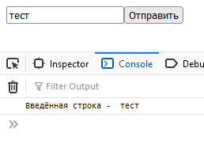

# Упражнения на понимание базовых вещей в front-end

## Упражнение 1

Чтобы начать делать упражнения в более простой и понятной форме требуется разработать первоначальное окно. Окно будет простейшим, без стилей, которое должно принимать на вход строку через `input` и `button`.

Окно должно работать через нажатие на кнопку и через нажатие на `Enter`.

В результате ввода пользователя и отправки данных строка, написанная в `input` должна отобразиться в консоле.

### Пример упражнения 1

## Упражнение 2

Добавить на прошлую форму новые элементы. Один элемент будет радиокнопкой с двумя вариантами, "по возрастанию" и "по убыванию". Второй элемент будет кнопкой "сортировать".

1. Пользователь вводит в первое текстовое поле любое количество слов (по одному, через enter или нажатие на кнопку).
2. Выбирает один из 2х вариантов сортировки.
3. После этого внизу появляется недоступный для редактирования список отсортированных элементов.

## Упражнение 3

За основу можно взять первое упражнение. Ниже кнопки "отправить" надо будет добавить элемент множественного выбора, ещё ниже радиокнопки и кнопку "посчитать".

1. Пользователь вводит через пробел любое количество чисел (через enter или нажатие на кнопку).
2. После этого все числа разбиваются по пробелам и составляется ниже кнопки элемент, в котором можно выбрать от 1 до всех чисел.
3. В радиокнопках должны быть доступны `+`, `-`, `*`, `/`.
4. После нажатия на кнопку "посчитать" над всеми числами из множественного выбора сверху вниз производится выбранное действие.

